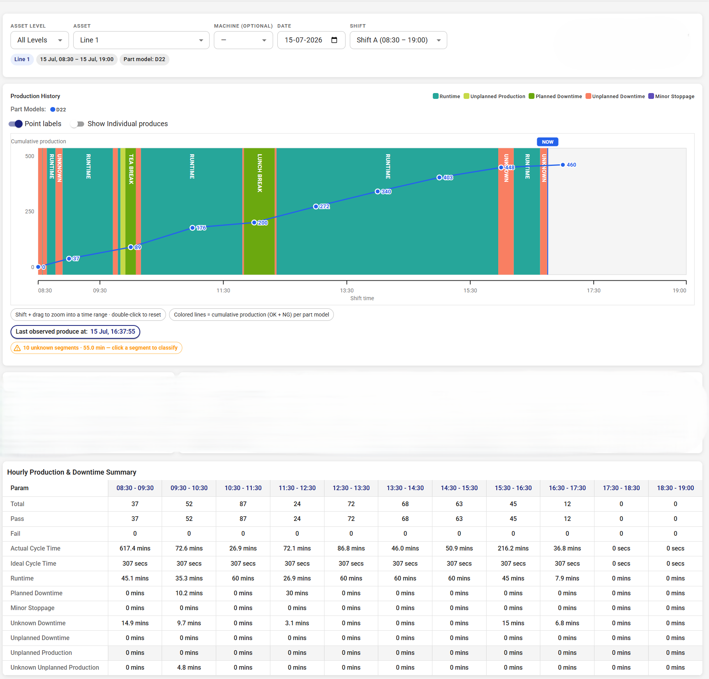
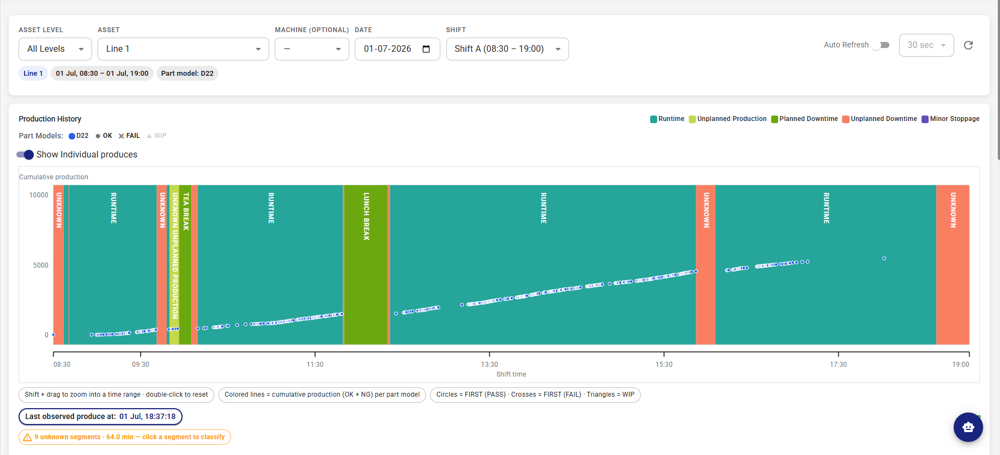

# Senior Frontend Assignment — Timeline Dashboard (with Auth)

## Overview

Build a small React app with two things:

1. **Authentication** — a login screen, token-based session management, and protected routes.
2. **Timeline Dashboard** — after login, a single dashboard screen that shows, for one machine
   on one shift, an **interactive timeline chart** and an **hourly production & downtime summary**.

This talks to a **real backend**. You will be given a base URL and test credentials (below).
This is not a mock exercise — you are wiring up real login, real sessions, and a real analytics
endpoint.

**Scope note.** The dashboard has two parts: an **interactive timeline chart** and an **Hourly
Production & Downtime Summary** table. The chart is the hardest piece — with "Show individual
produces" on it must stay smooth under tens of thousands of points. There is still a real
"Out of scope" list — read it so you don't over-build.

**Time:** 1 week. If time is running short, reduce the scope to ensure the core functionality is completed, and say
what you cut in `NOTES.md`. We would rather see the chart with large data points rendered properly than
every corner half-finished.

---

## What we give you

- **Backend base URL:** `https://fractaldmsdev.centralindia.cloudapp.azure.com`
  — endpoints sit at the **host root** (there is **no `/api` prefix**).
- **Test credentials:** username / password — **user: analytics_user, pass: dashboard123**.
- **Data is available for 22–25 June 2026.** Query dates in that range or you'll get empty shifts.
- **Every endpoint you need is real** — auth, the asset tree (machine list), shifts, and the
  timeline data. See **Appendix A** for the full list with request/response examples.
- **Screenshots** of the target UI (login, timeline chart with individual produces **on** and
  **off**, hourly table) — attached as image files.
- **`sample-payloads/`** — small, valid JSON fixtures, one per endpoint, that you can import for
  offline work: `sample-auth-login.json`, `sample-auth-me.json`, `sample-auth-logout.json`,
  `sample-assets-tree.json`, `sample-shifts.json`, `sample-machine-intervals.json`,
  `sample-analytics-query-cycle-time.json`, `sample-error-401.json`. They show the exact response
  shapes; the **live** backend returns far more `produces` rows (see 2.2).

The screenshots are the visual source of truth. Where this document and a screenshot disagree,
ask — don't guess.

---

## Tech

- **React 18 + TypeScript.** Use Vite.
- **MUI v6** for components (the screenshots are MUI-based). You may add any libraries you want.
- State/data-fetching approach is your call (Context, Redux Toolkit, React Query, plain hooks —
  justify it briefly in `NOTES.md`).

---

## Part 1 — Authentication & Session

### 1.1 Login screen

A username + password form. Validate that both are present. Show a clear inline error when the
backend rejects the credentials (HTTP 401). Show a loading state while the request is in flight.

### 1.2 The login call

```
POST {baseUrl}/auth/login
Content-Type: application/json

{ "username": "...", "password": "..." }
```

Success response:

```json
{ "access_token": "eyJ...", "token_type": "bearer" }
```

### 1.3 Session & token storage — _this is a graded part of the assignment_

The backend returns the access token **in the JSON login response body**.

- **Where you store the token is your decision — `localStorage`, `sessionStorage`, a cookie, or
  in-memory.** There is no single right answer; we want to see that you understand the trade-offs
  and can justify your pick. **State your choice and your reasoning in `NOTES.md`.**
- Every authenticated API call reads the token and sends it as an `Authorization: Bearer <token>`
  header. Centralise this in one API client — don't repeat the header wiring in each call.
- **On app load, restore the session** so a page refresh keeps the user logged in (unless your chosen
  storage is deliberately in-memory — if so, say why that's an acceptable trade-off). Validate the
  session by calling `GET /auth/me` before showing the dashboard; if that call 401s, clear the
  token and send the user to `/login`.

### 1.4 Current user

```
GET {baseUrl}/auth/me        (authenticated)
```

Returns the logged-in user's profile — at minimum `id`, `username`, `name`, `email`, `roles`.
Show the user's name somewhere in the app shell (e.g. a header menu).

### 1.5 Protected routes & logout

- The dashboard route must be reachable **only** when there is a valid session. An unauthenticated
  visitor is redirected to `/login`.
- **401 handling:** if any authenticated call returns HTTP 401, treat the session as expired — clear
  the stored token and redirect to `/login`.
- A **logout** action calls `POST {baseUrl}/auth/logout`, clears the stored token, and returns to
  `/login`.

---

## Part 2 — Timeline Dashboard

After login, the dashboard shows data for **one machine, one date, one shift**.
**[]**
**[]**

### 2.1 Filter bar

- **Machine / line** selector — populated from the **asset tree** (`GET /core/assets/tree`,
  Appendix A). The tree is a hierarchy of assets; each node has an `id` and an `assetlevel_id`.
  The selected node's `id` + `assetlevel_id` become the `entity_scope` of the data call (2.2).
  You may let the user pick any node, or flatten to the machine/line nodes — your call; note it in
  `NOTES.md`.
- **Shift** selector — populated from `GET /core/shifts` (Appendix A). Each shift has a
  `shift_timings` list of `"HH:MM"` **shift start times** (local IST); each entry starts a shift that
  runs until the next entry, and the last wraps around to the first. **Do not hard-code A/B/C** —
  this backend defines its own shifts (e.g. `"main"` with `["00:30", "12:30"]` ⇒ `00:30–12:30` and
  `12:30–00:30`).
- **Date** picker.
- A **"Show individual produces"** toggle (drives the chart — see 2.3).
- A manual **refresh** button.
- Changing any filter refetches the data.

The selected **date + shift** define the time window: combine the date with the shift's start/end
`HH:MM`. If the shift end is ≤ its start, it crosses midnight into the next day. This window is what
you send as `time_range` — **converted to UTC** (see 2.2).

### 2.2 The data call

```
POST {baseUrl}/analytics-query/machine-intervals        (authenticated)
Content-Type: application/json

{
  "entity_scope": {
    "type": "asset",
    "asset": { "asset_id": "83d34607-5e52-4b6b-86c2-a5f8d8fdf5cb", "asset_level_id": 50 }
  },
  "time_range": {
    "from_ts": "2026-06-23T07:00:00Z",
    "to_ts":   "2026-06-23T19:00:00Z"
  },
  "produce_counts": true,
  "exact_produces": false,
  "group_produce_counts_by_part_model": true
}
```

- `asset_id` + `asset_level_id` come from the **asset tree** (the node the user picked, 2.1).
- **`time_range` is in UTC (`Z`).** Build the shift window in IST (date + shift `HH:MM`), then
  convert to UTC for the request. The response timestamps are **also UTC** and must be converted
  **back to IST** for display (2.2a).
- Set **`exact_produces: true`** only when "Show individual produces" is on — it adds the `produces`
  array (**10,000–20,000 rows**), so request it only when needed.

Response (unwrapped from the envelope — timestamps are **UTC**):

```json
{
  "machine_ids": [1, 2, 3],
  "runtimes": [
    {
      "start_at": "2026-06-23T07:03:56Z",
      "end_at": "2026-06-23T07:16:54Z",
      "type": "planned",
      "runtime_name": null
    },
    {
      "start_at": "2026-06-23T08:20:00Z",
      "end_at": "2026-06-23T08:24:48Z",
      "type": "unknown unplanned production",
      "runtime_name": null
    }
  ],
  "downtimes": [
    {
      "start_at": "2026-06-23T07:16:54Z",
      "end_at": "2026-06-23T07:23:43Z",
      "downtime_name": "unknown",
      "type": "unknown"
    }
  ],
  "stoppages": [],
  "produce_counts": [
    {
      "bucket_start": "2026-06-23T07:00:00Z",
      "part_model_id": "c6f2562f-…",
      "ok_count": 37,
      "ng_count": 0
    },
    {
      "bucket_start": "2026-06-23T08:00:00Z",
      "part_model_id": "c6f2562f-…",
      "ok_count": 52,
      "ng_count": 0
    }
  ],
  "produces": [
    {
      "bucket_start": "2026-06-23T07:00:00Z",
      "part_model_id": "c6f2562f-…",
      "produces": [
        {
          "produce_id": "98b2c935-…",
          "first_seen_ts": "2026-06-23T07:39:37Z",
          "result": "PASS",
          "produce_type": "FIRST",
          "part_model_id": "c6f2562f-…"
        },
        {
          "produce_id": "8f132c79-…",
          "first_seen_ts": "2026-06-23T07:37:37Z",
          "result": "FAIL",
          "produce_type": "FIRST",
          "part_model_id": "c6f2562f-…"
        }
      ]
    }
  ]
}
```

- `runtimes`, `downtimes`, `stoppages` are the **timeline segment bands**. The backend already
  returns them **tiled and non-overlapping**, and it **fills the gaps for you** — a period the
  machine was neither running nor in a known downtime comes back as a `downtime` with
  `type: "unknown"`. A runtime `type` may be `"planned"` or `"unknown unplanned production"`.
  _You do not need to resolve overlaps or invent gap segments — but see 2.4 for the light
  robustness guard we do expect._
- `produce_counts` — **hourly** OK/NG buckets, one per `part_model_id` per hour (because of
  `group_produce_counts_by_part_model`). Sum across part models for an hour's total.
- `produces` — present **only when `exact_produces: true`**: hourly buckets, each holding the
  individual part rows (`produce_id`, `first_seen_ts`, `result` = `PASS` / `FAIL`, `part_model_id`).
  **`first_seen_ts` is not sorted** — don't assume order. Flatten across buckets for the full list.

#### 2.2a Timezone — read this

The API speaks **UTC**; the UI speaks **IST (Asia/Kolkata, +05:30)**. Every timestamp you send goes
out as UTC, and every timestamp you display (axis ticks, hourly buckets, tooltips, the table) must be
converted to IST. Getting this wrong shifts the whole timeline by 5½ hours — we will check for it.

### 2.3 Timeline chart — _the hardest part; performance is graded_

A horizontal, time-scaled view of the shift, from `from_ts` to `to_ts`:

- **Segment bands** along the timeline, coloured by kind (runtime / unknown-unplanned-production /
  unknown-downtime / stoppage). Build them directly from the `runtimes` + `downtimes` + `stoppages`
  arrays — the backend already returns them tiled and clipped to the window, so you just draw them.
  The chart bands and the hourly table (2.4) must agree, since both read the same segments.
- **Produce markers** on the same time axis, coloured by result: **PASS / FAIL**. These come from
  `produce_counts` (hourly, coarse) when the toggle is off, and from the flattened `produces` list
  (every part) when **"Show individual produces"** is on.
- **Zoom** — let the user zoom into a time range and reset back out (e.g. brush a range to zoom,
  double-click to reset). A minimum zoom span (e.g. 60s) is fine. **Pan is not required.**
- **Hover tooltip** — hovering near a produce marker shows its timestamp and result. (Hover on a
  segment band to show its kind/duration is optional.)

**The performance requirement — this is the point of the section.** With **"Show individual
produces" on, the chart must stay interactive at 10,000–20,000 markers** — smooth zoom and hover,
no multi-second freezes. _How_ you achieve that is your call (canvas vs SVG, downsampling,
memoization, virtualization, a charting library — anything), but you must be able to defend it in
`NOTES.md`. Two rules:

- **If you thin/downsample markers, never drop a FAIL.** Hiding a defect to make the chart faster is
  worse than a slow chart — an operator looks at this screen precisely to find the failures.
- Don't do per-marker date parsing or colour lookups inside the render path; resolve geometry once.

### 2.4 Hourly Production & Downtime Summary — _the core of Part 2_

A table with **one column per hour** of the shift (in IST) and these rows:

| Row                  | Value per hour                                                    |
| -------------------- | ----------------------------------------------------------------- |
| Total                | produce count in that hour (`ok + ng`, summed across part models) |
| Pass                 | `ok_count` in that hour                                           |
| Fail                 | `ng_count` in that hour                                           |
| Runtime              | minutes the machine was running in that hour                      |
| Unplanned Production | minutes of `"unknown unplanned production"` runtime in that hour  |
| Stoppage             | minutes of stoppage in that hour                                  |
| Unknown Downtime     | minutes of `type: "unknown"` downtime in that hour                |
| Ideal Cycle Time     | `ideal_cycle_time_seconds` for that hour (from a second call)     |
| Actual Cycle Time    | `actual_cycle_time_seconds` for that hour (from a second call)    |

The segments are already tiled and clipped to the requested window by the backend, so the work here
is **conversion and bucketing** — not overlap resolution:

- **Convert** every segment's `start_at` / `end_at` from UTC to IST.
- **Bucket into hours.** The table has one row per clock hour (08:00–09:00, 09:00–10:00, …). A
  segment can span several hours (e.g. 08:33 → 10:12), so cut it at each hour boundary and add each
  piece's minutes to that hour's row, keeping each kind separate. Example: 08:33 → 10:12 runtime =
  27 min in the 08:00–09:00 row, 60 min in 09:00–10:00, 12 min in 10:00–11:00.
- **Produce rows** come from `produce_counts` — group into the right hour, summing across part models.
- **Cycle-time rows come from a separate endpoint.** The Ideal / Actual Cycle Time rows are **not**
  in the machine-intervals response — fetch them from `POST {baseUrl}/analytics-query` with
  `distribution: "hourly"` (same `entity_scope` and `time_range`, see Appendix A). It returns one
  row per hour, each with `bucket_start`, `ideal_cycle_time_seconds`, and `actual_cycle_time_seconds`;
  match each row into its hour by `bucket_start`. Values can be `null` for hours with no data — leave
  those cells blank.
- **In-progress shift:** if the window's end is in the future, only fill buckets up to "now" (IST);
  later hours are empty, not zero-filled to 60.

A per-hour sanity check that should roughly hold: for each fully-elapsed hour,
`runtime + unplanned-production + stoppage + unknown ≈ 60` minutes (± rounding).

### 2.5 States

Handle explicitly: **loading**, **error** (with a retry — the backend can return HTTP 500; a couple
of retries with backoff is reasonable), **empty** (a shift with no data — empty arrays), and
**in-progress shift** (current shift, partially elapsed — buckets after "now" in IST stay empty).

---

## Out of scope — do **not** build these

The real screen has more; we removed it on purpose. **Do not** build:

- **clicking a segment to classify it** / any create-downtime or create-unplanned-production dialogs;
- **auto-refresh / polling** — a manual refresh button is enough;
- CSV / PDF export;
- i18n, multi-theme support, or a settings/preferences area;
- a full asset-hierarchy drill-down dashboard or machine-group / multi-machine views. (Using the
  asset tree to **pick one machine/line** for the filter is in scope — building a browsable
  hierarchy view is not.)

If you finish early, put the polish into **chart performance, error handling, edge cases, and
`NOTES.md`** — not extra features.

---

## 3 Backend conventions

### 3.1 The MES

Every response is wrapped in:

```json
{ "trace_id": "…", "status_code": 200, "message": "OK", "data": { … } }
```

Unwrap it: on success use `data`; when `status_code >= 400`, surface `message` as the error. The
JSON shapes shown above are the **unwrapped** `data`.

### 3.1a Timezone

The API is **UTC**; the UI is **IST (+05:30)**. Convert on the way out (shift window → UTC) and on
the way in (every displayed timestamp → IST). See 2.2a.

### 3.2 Errors you must handle

- **401** on any authenticated call → session expired → clear the stored token, redirect to `/login`.
  (On `/auth/login` itself, 401 just means bad credentials — show the message, don't redirect.)
- **403** → show "access denied".
- **422** → validation error; the body carries field messages.
- **500** → retryable; retry a couple of times with backoff before showing the error state.

---

## What to submit

1. The code (git repo).
2. A Deployed link (Netlify, vercel, etc.)
2. **`NOTES.md`:**
   - how you did **session/token** management — **where you chose to store the token and why**
     (the trade-off you weighed), refresh-on-load, how it moves from the login body onto the
     `Authorization` header, and how you handle expiry;
   - **how you kept the chart fast** with individual produces on — the rendering approach you chose,
     why, how you thin points without losing FAILs, and how you convinced yourself it stays smooth;
   - how you handle **time** (UTC↔IST conversion) and how you bucket the segments into the
     hourly table;
   - any assumptions you made, and anything you cut and why.
3. A short note on how to run it (`npm install`, env var for the base URL, `npm run dev`).

---

### Red flags

- Chart freezes / drops frames with individual produces on · downsampling that hides FAIL markers ·
  **timeline shifted 5½ hours (UTC shown as local, or no conversion)** · auth header wired ad-hoc in
  each call instead of a central client · no refresh-on-load (refresh logs you out) · 401 not handled ·
  chart and table disagree · per-hour minutes that don't add up.

---

## Questions? Book a doubt-clearing call

If anything in this assignment is unclear — a requirement, an API behaviour, or scope — you can get
on a **15-minute call** with us to clear your doubts. Reply to the same Email with your
questions and availability, and we'll schedule the call. One call per candidate; come with your
questions listed so we can cover everything in the slot.

Asking is not a negative signal — a clarifying question beats a wrong assumption.

---

## Running (once the candidate has it set up)

```bash
npm install
# set the backend base URL (see .env.example)
npm run dev
```

---

## Appendix A — API reference

Base URL: `https://fractaldmsdev.centralindia.cloudapp.azure.com` (**no `/api`**). Every response is
the MES envelope `{ trace_id, status_code, message, data }` — the shapes below are the `data`.
All timestamps are **UTC**. Data exists for **22–25 June 2026**.

| #   | Method & path                             | Purpose                             |
| --- | ----------------------------------------- | ----------------------------------- |
| 1   | `POST /auth/login`                        | log in                              |
| 2   | `GET /auth/me`                            | current user                        |
| 3   | `POST /auth/logout`                       | log out                             |
| 4   | `GET /core/assets/tree`                   | machine/line list (asset hierarchy) |
| 5   | `GET /core/shifts`                        | shift definitions                   |
| 6   | `POST /analytics-query/machine-intervals` | timeline data                       |
| 7   | `POST /analytics-query`                   | hourly cycle-time metrics           |

**1. Login** — `POST /auth/login`, body `{ "username": "...", "password": "..." }`

```json
{ "access_token": "…", "token_type": "bearer" }
```

**2. Current user** — `GET /auth/me` (authenticated)

```json
{
  "id": "a7c6…",
  "username": "user",
  "name": "User",
  "email": "user@mail.com",
  "customer_id": "83d3…",
  "customer_name": "Noviga",
  "roles": ["SuperAdmin"],
  "status": "active"
}
```

**4. Asset tree** — `GET /core/assets/tree` — nested; each node has `id`, `assetlevel_id`, `children`

```json
[
  {
    "id": "83d3…",
    "name": "Noviga",
    "assetlevel_id": 50,
    "hierarchy": null,
    "children": [
      {
        "id": "b95f…",
        "name": "Noida",
        "assetlevel_id": 40,
        "children": [
          {
            "id": "04f3…",
            "codename": "AOI - 01",
            "name": "AOI",
            "assetlevel_id": 10,
            "children": []
          }
        ]
      }
    ]
  }
]
```

Use a node's `id` + `assetlevel_id` as the `entity_scope.asset` in endpoint 6.

**5. Shifts** — `GET /core/shifts`

```json
[
  {
    "id": "b4bb…",
    "code": "main",
    "name": "main",
    "shift_timings": ["00:30", "12:30"],
    "is_active": true
  }
]
```

`shift_timings` is a list of **shift start times** in `"HH:MM"` local IST — not a `[start, end]` pair.
Each entry starts a shift that runs until the next entry; the last entry runs until the first one
(crossing midnight). E.g. `["00:30", "12:30"]` ⇒ two shifts: `00:30–12:30` and `12:30–00:30`.

**6. Timeline data** — `POST /analytics-query/machine-intervals` — see 2.2 for the full request and
response. `sample-payloads/sample-machine-intervals.json` is a small valid fixture; with
`exact_produces: true` the live response carries **10,000–20,000** `produces` rows.

**7. Cycle-time metrics** — `POST /analytics-query` (authenticated) — feeds the Ideal / Actual Cycle
Time rows of the hourly table (2.4). Same `entity_scope` and `time_range` as endpoint 6, plus
`metrics` and `distribution: "hourly"`:

```json
{
  "entity_scope": {
    "type": "asset",
    "asset": { "asset_id": "283f…", "asset_level_id": 20 }
  },
  "metrics": ["ideal_cycle_time_seconds", "actual_cycle_time_seconds"],
  "time_range": { "from_ts": "2026-06-23T07:00:00Z", "to_ts": "2026-06-23T19:00:00Z" },
  "distribution": "hourly"
}
```

`data` is an **array of hourly buckets** (many nullable metric fields; only the requested `metrics`
are populated):

```json
[
  {
    "entity_id": "283f…",
    "bucket_start": "2026-06-23T07:00:00Z",
    "ideal_cycle_time_seconds": 307,
    "actual_cycle_time_seconds": 14514.5
  }
]
```

Match each bucket into its hour by `bucket_start` (UTC → IST). Metric values may be `null` — render
those cells blank.
